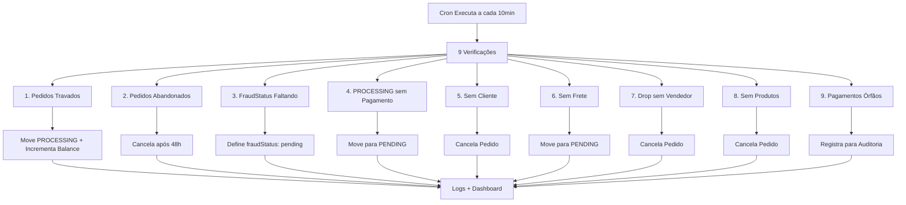

# 🔍 Sistema de Verificação de Consistência

Sistema automatizado que detecta e corrige inconsistências nos pedidos.

## 📋 O que é Verificado

### 1. Pedidos Travados
- **Problema**: Pedidos com pagamento e antifraude aprovados mas não estão em PROCESSING
- **Solução**: Move para PROCESSING e incrementa balance dos vendedores
- **Quando**: Qualquer pedido neste estado

### 2. Pedidos Abandonados
- **Problema**: Pedidos aprovados pelo antifraude mas sem pagamento por mais de 48h
- **Solução**: Cancela o pedido automaticamente
- **Quando**: Pedidos com mais de 2 dias sem pagamento

### 3. FraudStatus Faltando
- **Problema**: Pedidos com score alto (≥30) mas sem fraudStatus definido
- **Solução**: Define fraudStatus como 'pending'
- **Quando**: Qualquer pedido com score alto sem status

### 4. ⚠️ Pedidos em PROCESSING Sem Pagamento
- **Problema**: Pedidos em processamento mas sem pagamento aprovado
- **Solução**: Move de volta para PENDING até pagamento ser confirmado
- **Quando**: Qualquer pedido PROCESSING com paymentStatus != 'approved'

### 5. ⚠️ Pedidos Sem Cliente Válido (Órfãos)
- **Problema**: Pedidos onde o usuário não existe mais no sistema
- **Solução**: Cancela o pedido automaticamente
- **Quando**: Pedidos com buyerId inválido ou usuário deletado

### 6. ⚠️ Pedidos Sem Frete Calculado
- **Problema**: Pedidos em PROCESSING/SHIPPED sem frete ou transportadora
- **Solução**: Move para PENDING para recalcular frete
- **Quando**: Pedidos com shippingCost=0/null ou shippingMethod vazio

### 7. ⚠️ Pedidos Dropshipping Sem Vendedor
- **Problema**: Produtos drop sem sellerId definido
- **Solução**: Cancela o pedido (não pode ser processado)
- **Quando**: Pedidos com produtos isDrop=true mas sellerId=null

### 8. ⚠️ Pedidos Sem Produtos (Vazios)
- **Problema**: Pedidos sem nenhum item vinculado
- **Solução**: Cancela o pedido automaticamente
- **Quando**: Pedidos onde orderItems está vazio

### 9. ℹ️ Auditoria de Pagamentos Órfãos
- **Problema**: Pagamentos sem pedidos vinculados
- **Solução**: Registra para auditoria (não deleta automaticamente)
- **Quando**: paymentIds que não existem em nenhum pedido

## ⚙️ Como Funciona

### Verificação Automática
- **Intervalo**: A cada 10 minutos
- **Início**: Automático quando o servidor inicia
- **Localização**: `lib/order-consistency-cron.ts`

### Verificação Manual
- **Acesso**: `/admin/consistency`
- **Quando usar**: Para verificação imediata ou debug
- **API**: `POST /api/admin/consistency/check`

## 🔄 Fluxo de Correção



## 🛡️ Segurança

### Lock de Execução
- Impede sobreposição de verificações
- Se uma verificação está rodando, a próxima aguarda

### Transações
- Todas as correções usam `$transaction` do Prisma
- Garante atomicidade (tudo ou nada)
- Evita estados parciais

### Balance dos Vendedores
- Verifica se já foi incrementado antes de adicionar
- Usa heurística para evitar duplicação
- Logs detalhados de cada operação

## 📊 Monitoramento

### Logs do Console
```typescript
[Consistency Check] Iniciando verificação...
[Consistency] Encontrados 3 pedidos travados
[Consistency] ✅ Pedido abc123 corrigido
[Consistency] Balance incrementado: Vendedor xyz + R$ 150.00
```

### Dashboard Admin
- Acesse `/admin/consistency`
- Veja estatísticas em tempo real
- Execute verificações manuais
- Visualize histórico de correções

## 🛠️ Configuração

### Alterar Intervalo
Edite `lib/order-consistency-cron.ts`:
```typescript
const CHECK_INTERVAL = 10 * 60 * 1000 // 10 minutos
```

### Desabilitar Verificação Automática
Em `lib/init.ts`, comente a linha:
```typescript
// startConsistencyCron()
```

### Logs
Todas as operações são logadas no console:
```
[Consistency Cron] Iniciando verificação...
[Consistency] Encontrados 3 pedidos travados
[Consistency] ✅ Pedido cmk123abc corrigido
[Consistency Cron] ⚠️ Encontrados 5 problemas, 5 corrigidos
```

## 🔒 Segurança

### Proteção contra Duplicação
- Usa lock (`isRunning`) para evitar execuções simultâneas
- Verifica balance antes de incrementar (heurística)
- Transações atômicas no banco de dados

### Permissões
- Verificação automática: Sem autenticação (processo interno)
- Verificação manual: Apenas ADMIN
- API protegida com autenticação

## 📊 Monitoramento

### Painel Admin
- **URL**: `/admin/consistency`
- **Funcionalidades**:
  - Visualizar última verificação
  - Executar verificação manual
  - Ver detalhes dos problemas encontrados

### Logs
```bash
# Terminal do servidor
[Consistency Cron] Iniciando verificação...
[Consistency] Encontrados 3 pedidos travados
[Consistency] ✅ Pedido xxx corrigido
[Consistency Cron] ✅ Nenhuma inconsistência encontrada
```

## 📊 Métricas

O sistema registra:
- Total de verificações executadas
- Problemas encontrados
- Problemas corrigidos
- Erros durante correção

## 🛠️ Configuração

### Mudar Intervalo de Verificação

Editar `lib/order-consistency-cron.ts`:

```typescript
const CHECK_INTERVAL = 10 * 60 * 1000 // 10 minutos
```

### Desabilitar Verificação Automática

Em `lib/init.ts`, comentar:
```typescript
// startConsistencyCron()
```

## 🚨 Logs

Todas as verificações são logadas no console:

```
🔍 [Consistency Check] Iniciando verificação de consistência...
1️⃣ Verificando pedidos travados...
[Consistency] Encontrados 2 pedidos travados
[Consistency] ✅ Pedido cmk3p2d3... corrigido
[Consistency] Balance incrementado: Vendedor abc12345 + R$ 150.00
✅ [Consistency Check] Verificação concluída em 234ms
```

## 🛠️ Arquivos do Sistema

### Core
- `lib/order-consistency-checker.ts` - Lógica de verificação e correção
- `lib/order-consistency-cron.ts` - Cron job automático
- `lib/init.ts` - Inicialização automática

### APIs
- `POST /api/admin/consistency/check` - Executa verificação manual
- `GET /api/admin/consistency/status` - Status do cron

### UI
- `/admin/consistency` - Painel de verificação manual

## 🚨 Quando Executar Manualmente

1. **Após Incidente**: Se houve um problema no sistema
2. **Manutenção**: Após fazer alterações no fluxo de pedidos
3. **Debug**: Para investigar problemas específicos
4. **Auditoria**: Para gerar relatório de inconsistências

## 📊 Logs

O sistema loga todas as ações:

```
[Consistency Check] Iniciando verificação...
[Consistency] Encontrados 3 pedidos travados
[Consistency] ✅ Pedido abc123 corrigido
[Consistency] Balance incrementado: Vendedor xyz12345 + R$ 50.00
[Consistency Check] Verificação concluída em 1234ms
```

## 🛡️ Segurança

### Lock de Execução
- Previne execuções simultâneas
- Se uma verificação está rodando, a próxima é pulada

### Validações
- Verifica se balance já foi incrementado antes de duplicar
- Usa transações do Prisma para garantir atomicidade
- Logs detalhados de todas as operações

## 📊 Logs

Todos os logs são prefixados com `[Consistency]` ou `[Consistency Cron]`:

```
🔍 [Consistency Check] Iniciando verificação de consistência...

1️⃣ Verificando pedidos travados...
[Consistency] Encontrados 2 pedidos travados
[Consistency] ✅ Pedido cmk123abc corrigido
[Consistency] Balance incrementado: Vendedor abc12345 + R$ 50.00

2️⃣ Verificando pedidos abandonados...
[Consistency] Encontrados 1 pedidos abandonados
[Consistency] ✅ Pedido xyz789 cancelado após 48h

3️⃣ Verificando fraudStatus...
[Consistency] Encontrados 0 pedidos sem fraudStatus

4️⃣ Verificando pedidos sem pagamento...
[Consistency] Encontrados 3 pedidos em PROCESSING sem pagamento
[Consistency] ✅ Pedido abc456 movido para PENDING

5️⃣ Verificando pedidos órfãos...
[Consistency] Encontrados 1 pedidos sem cliente válido
[Consistency] ✅ Pedido órfão def789 cancelado

6️⃣ Verificando pedidos sem frete...
[Consistency] Encontrados 2 pedidos sem frete válido
[Consistency] ✅ Pedido ghi012 sem frete movido para PENDING

7️⃣ Verificando pedidos drop...
[Consistency] Encontrados 1 pedidos drop sem vendedor
[Consistency] ✅ Pedido drop jkl345 sem vendedor cancelado

8️⃣ Verificando pedidos vazios...
[Consistency] Encontrados 0 pedidos sem produtos

9️⃣ Verificando pagamentos órfãos...
[Consistency] Total de paymentIds válidos: 127

✅ [Consistency Check] Verificação concluída em 1847ms
   Total verificado: 9
   Problemas encontrados: 10
   Problemas corrigidos: 10

[Consistency Cron] ⚠️ Encontrados 10 problemas, 10 corrigidos
```

## 🚀 Inicialização

O cron é iniciado automaticamente em `lib/init.ts`:

```typescript
startConsistencyCron() // Inicia verificação a cada 10 minutos
```

## 🔧 Configuração

Para alterar o intervalo de verificação, edite `lib/order-consistency-cron.ts`:

```typescript
const CHECK_INTERVAL = 10 * 60 * 1000 // 10 minutos
```

## 📝 Notas Importantes

1. **Thread Safe**: Usa lock (`isRunning`) para evitar execuções sobrepostas
2. **Transações**: Todas as correções usam transações do Prisma
3. **Idempotente**: Pode ser executado múltiplas vezes sem duplicar correções
4. **Logs Detalhados**: Cada ação é registrada para auditoria
5. **Não Bloqueia**: Execução assíncrona não afeta performance

## 🐛 Debug

Para debug manual via API:

```bash
# Status do cron
curl http://localhost:3000/api/admin/consistency/status

# Executar verificação manual
curl -X POST http://localhost:3000/api/admin/consistency/check
```

## 📱 Interface Admin

Acesse `/admin/consistency` para:
- Ver status do cron automático
- Executar verificação manual
- Ver resultados da última verificação
- Ver detalhes de cada problema corrigido
