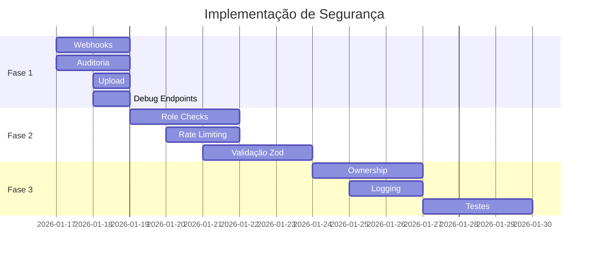

# ✅ CHECKLIST DE CORREÇÕES DE SEGURANÇA

## 🔴 FASE 1: EMERGENCIAL (48 horas)

### 1. Webhooks - Validação de Assinatura HMAC

- [ ] **`/api/payment/webhook`**
  ```typescript
  // Adicionar validação HMAC
  const signature = request.headers.get('x-signature');
  const isValid = validateMercadoPagoSignature(signature, body, webhookSecret);
  if (!isValid) return 401;
  ```

- [ ] **`/api/webhooks/mercadolivre`**
  ```typescript
  // Adicionar validação de token ML
  const isValid = validateMLWebhook(request);
  if (!isValid) return 401;
  ```

- [ ] **`/api/admin/mercadopago/webhook`**
  ```typescript
  // Mesma validação HMAC
  ```

### 2. Auditoria Financeira

- [ ] Criar tabela `AuditLog` no banco
  ```sql
  CREATE TABLE "AuditLog" (
    "id" TEXT PRIMARY KEY,
    "action" TEXT NOT NULL,
    "userId" TEXT NOT NULL,
    "entityType" TEXT,
    "entityId" TEXT,
    "oldValue" TEXT,
    "newValue" TEXT,
    "metadata" TEXT,
    "ip" TEXT,
    "userAgent" TEXT,
    "createdAt" TIMESTAMP DEFAULT NOW(),
    FOREIGN KEY ("userId") REFERENCES "User"("id")
  );
  ```

- [ ] Criar helper de auditoria
  ```typescript
  // lib/audit.ts
  export async function auditLog(data: AuditLogData) {
    return prisma.auditLog.create({ data });
  }
  ```

- [ ] **`/api/admin/financeiro/aprovar-pagamento`**
  - [ ] Adicionar auditLog() antes e depois da operação
  - [ ] Logar paymentId, valor, status anterior e novo

- [ ] **`/api/admin/financeiro/refund`**
  - [ ] Adicionar auditLog() no processamento
  - [ ] Logar dados do estorno

- [ ] **`/api/admin/saques/[id]/aprovar`**
  - [ ] Adicionar auditLog() na aprovação
  - [ ] Logar valor, vendedor, admin aprovador

- [ ] **`/api/admin/saques/[id]/pagar`**
  - [ ] Adicionar auditLog() no pagamento
  - [ ] Logar dados bancários (sem expor completamente)

- [ ] **`/api/admin/saques/[id]/concluir`**
  - [ ] Adicionar auditLog() na conclusão

- [ ] **`/api/admin/saques/[id]/rejeitar`**
  - [ ] Adicionar auditLog() na rejeição
  - [ ] Logar motivo

### 3. Upload de Arquivos

- [ ] **`/api/upload`**
  ```typescript
  // 1. Adicionar autenticação
  const session = await getServerSession(authOptions);
  if (!session?.user) return 401;
  
  // 2. Rate limiting
  const limit = await checkRateLimit(session.user.id, 'upload', 10, 60000);
  if (!limit.allowed) return 429;
  
  // 3. Logging
  await logApi({
    action: 'FILE_UPLOAD',
    userId: session.user.id,
    metadata: { fileName, size, type }
  });
  ```

### 4. Endpoints Debug

- [ ] **`/api/debug/pending-orders`**
  ```typescript
  // OPÇÃO 1: Remover em produção
  if (process.env.NODE_ENV === 'production') {
    return NextResponse.json({ error: 'Not found' }, { status: 404 });
  }
  
  // OPÇÃO 2: Proteger com ADMIN
  const session = await getServerSession(authOptions);
  if (session?.user?.role !== 'ADMIN') return 403;
  ```

- [ ] **`/api/test/calculate-sign`** - Remover ou proteger
- [ ] **`/api/test/aliexpress-sign`** - Remover ou proteger  
- [ ] **`/api/test/aliexpress-sign-multi`** - Remover ou proteger

---

## 🟠 FASE 2: URGENTE (1 semana)

### 5. Role Checks em APIs Admin

Criar middleware reutilizável:
```typescript
// lib/auth-middleware.ts
export async function requireAdmin(request: NextRequest) {
  const session = await getServerSession(authOptions);
  
  if (!session?.user) {
    return { error: 'Não autenticado', status: 401 };
  }
  
  if (session.user.role !== 'ADMIN') {
    return { error: 'Acesso negado', status: 403 };
  }
  
  return { session };
}
```

Aplicar em todas estas APIs:

- [ ] `/api/admin/consistency/status`
- [ ] `/api/admin/financeiro/aprovar-pagamento`
- [ ] `/api/admin/financeiro/duplicados`
- [ ] `/api/admin/financeiro/pagamentos-pendentes`
- [ ] `/api/admin/financeiro/sync-payments`
- [ ] `/api/admin/integrations/aliexpress/oauth/callback`
- [ ] `/api/admin/integrations/whatsapp/config`
- [ ] `/api/admin/marketplaces/sync-all`
- [ ] `/api/admin/orders/auto-fetch`
- [ ] `/api/admin/orders/fetch-ml-orders`
- [ ] `/api/admin/orders/[id]/label`
- [ ] `/api/admin/products/[id]/delete-listing`
- [ ] `/api/admin/products/[id]/pause-listing`
- [ ] `/api/admin/products/[id]/publish`
- [ ] `/api/admin/products/[id]/sync-listing`

### 6. Rate Limiting Global

- [ ] Instalar dependências
  ```bash
  npm install @upstash/ratelimit @upstash/redis
  ```

- [ ] Configurar Upstash
  ```env
  UPSTASH_REDIS_REST_URL=
  UPSTASH_REDIS_REST_TOKEN=
  ```

- [ ] Criar rate limiters
  ```typescript
  // lib/rate-limit.ts
  import { Ratelimit } from '@upstash/ratelimit';
  import { Redis } from '@upstash/redis';
  
  const redis = Redis.fromEnv();
  
  export const rateLimiters = {
    upload: new Ratelimit({
      redis,
      limiter: Ratelimit.slidingWindow(10, '1 m'),
    }),
    payment: new Ratelimit({
      redis,
      limiter: Ratelimit.slidingWindow(5, '1 m'),
    }),
    api: new Ratelimit({
      redis,
      limiter: Ratelimit.slidingWindow(100, '1 m'),
    }),
  };
  ```

- [ ] Aplicar em APIs críticas:
  - [ ] `/api/payment/create`
  - [ ] `/api/payment/check-pending`
  - [ ] `/api/upload` (já incluído na Fase 1)
  - [ ] `/api/orders` (criar pedido)

### 7. Validação com Zod

- [ ] Instalar Zod
  ```bash
  npm install zod
  ```

- [ ] Criar schemas globais
  ```typescript
  // lib/validation-schemas.ts
  import { z } from 'zod';
  
  export const refundSchema = z.object({
    paymentId: z.string().min(1).max(255),
    orderId: z.string().optional(),
    reason: z.string().max(500).optional(),
    amount: z.number().positive().optional(),
  });
  
  export const withdrawalSchema = z.object({
    amount: z.number().positive(),
    method: z.enum(['PIX', 'BANK_TRANSFER']),
    pixKey: z.string().optional(),
    // ...
  });
  
  export const productSchema = z.object({
    name: z.string().min(3).max(255),
    price: z.number().positive(),
    description: z.string().max(5000).optional(),
    // ...
  });
  ```

- [ ] Aplicar validação em APIs críticas:
  - [ ] `/api/admin/financeiro/refund`
  - [ ] `/api/admin/saques/*`
  - [ ] `/api/admin/products`
  - [ ] `/api/payment/create`
  - [ ] `/api/orders`

---

## 🟡 FASE 3: IMPORTANTE (2 semanas)

### 8. Ownership Verification

- [ ] **`/api/user/addresses/[id]`** (PUT/DELETE)
  ```typescript
  const address = await prisma.address.findUnique({
    where: { id: params.id }
  });
  
  if (!address || address.userId !== session.user.id) {
    return NextResponse.json({ error: 'Acesso negado' }, { status: 403 });
  }
  ```

- [ ] **`/api/orders/[id]`** (GET)
  ```typescript
  const order = await prisma.order.findUnique({
    where: { id: params.id }
  });
  
  if (!order || order.userId !== session.user.id) {
    return NextResponse.json({ error: 'Acesso negado' }, { status: 403 });
  }
  ```

- [ ] **`/api/vendedor/saques/[id]/cancelar`**
  ```typescript
  const withdrawal = await prisma.withdrawal.findUnique({
    where: { id: params.id },
    include: { seller: true }
  });
  
  if (!withdrawal || withdrawal.seller.userId !== session.user.id) {
    return NextResponse.json({ error: 'Acesso negado' }, { status: 403 });
  }
  ```

### 9. Logging Completo

- [ ] Criar helper de logging
  ```typescript
  // lib/api-logger.ts
  export async function logApi(data: {
    method: string;
    endpoint: string;
    statusCode: number;
    userId?: string;
    duration?: number;
    errorMessage?: string;
    metadata?: any;
  }) {
    // Log para banco de dados
    await prisma.apiLog.create({ data });
    
    // Log para serviço externo (Sentry, DataDog, etc)
    if (process.env.NODE_ENV === 'production') {
      // await sentry.captureMessage(...)
    }
  }
  ```

- [ ] Aplicar logging em todas APIs críticas
  - [ ] Todas as APIs financeiras
  - [ ] Todas as APIs admin
  - [ ] Todas as APIs de pedidos
  - [ ] Webhooks

### 10. Testes de Segurança

- [ ] Criar testes de autenticação
  ```typescript
  // __tests__/security/auth.test.ts
  describe('Autenticação', () => {
    it('deve bloquear acesso sem sessão', async () => {
      const res = await fetch('/api/admin/products');
      expect(res.status).toBe(401);
    });
    
    it('deve bloquear seller em rota admin', async () => {
      const session = createSellerSession();
      const res = await fetch('/api/admin/products', {
        headers: { 'Cookie': session }
      });
      expect(res.status).toBe(403);
    });
  });
  ```

- [ ] Criar testes de rate limiting
- [ ] Criar testes de validação
- [ ] Criar testes de ownership

---

## 🛡️ FASE 4: FORTALECIMENTO (Contínuo)

### Security Headers

- [ ] Adicionar em middleware.ts
  ```typescript
  response.headers.set('X-Content-Type-Options', 'nosniff');
  response.headers.set('X-Frame-Options', 'DENY');
  response.headers.set('X-XSS-Protection', '1; mode=block');
  response.headers.set('Strict-Transport-Security', 'max-age=31536000');
  response.headers.set('Content-Security-Policy', "default-src 'self'");
  ```

### CORS

- [ ] Revisar configuração de CORS
- [ ] Whitelist apenas domínios necessários
- [ ] Remover `Access-Control-Allow-Origin: *`

### Secrets Management

- [ ] Auditar variáveis de ambiente
- [ ] Remover secrets hardcoded
- [ ] Usar variáveis de ambiente para tudo
- [ ] Considerar vault (AWS Secrets Manager, Vault)

### Monitoramento

- [ ] Configurar Sentry
  ```bash
  npm install @sentry/nextjs
  npx @sentry/wizard@latest -i nextjs
  ```

- [ ] Configurar alertas para:
  - [ ] Muitas tentativas de login falhas
  - [ ] Webhooks com assinatura inválida
  - [ ] Operações financeiras acima de threshold
  - [ ] Uploads suspeitos

### Documentação

- [ ] Documentar padrões de segurança
- [ ] Criar guia de onboarding de segurança
- [ ] Manter este checklist atualizado

---

## 📊 TRACKING DE PROGRESSO

| Fase | Itens | Concluídos | Progresso |
|------|-------|------------|-----------|
| Fase 1 (Emergencial) | 15 | 0 | 0% |
| Fase 2 (Urgente) | 25 | 0 | 0% |
| Fase 3 (Importante) | 12 | 0 | 0% |
| Fase 4 (Contínuo) | 10 | 0 | 0% |
| **TOTAL** | **62** | **0** | **0%** |

---

## 👥 RESPONSÁVEIS

### Por Área

- **Webhooks:** [Nome do Dev Backend]
- **Financeiro/Auditoria:** [Nome do Dev Sênior]
- **Upload/Rate Limiting:** [Nome do Dev Backend]
- **Role Checks:** [Nome do Dev Full Stack]
- **Validação Zod:** [Todos os devs]
- **Testes:** [QA + Devs]
- **Monitoramento:** [DevOps]

### Code Review

- Todas as correções de segurança devem ter code review obrigatório
- Revisor deve ser diferente do autor
- Foco em: autenticação, autorização, validação, auditoria

---

## 📅 CRONOGRAMA



---

## ✅ COMO USAR ESTE CHECKLIST

1. **Atribua responsáveis** para cada item
2. **Marque [ ]** como **[x]** quando concluir
3. **Faça commit** após cada grupo de correções
4. **Rode os testes** antes de fazer deploy
5. **Atualize o tracking** de progresso semanalmente

---

**Última atualização:** 16 de Janeiro de 2026
**Próxima revisão:** 23 de Janeiro de 2026
